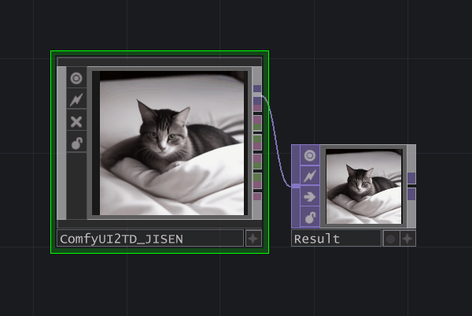
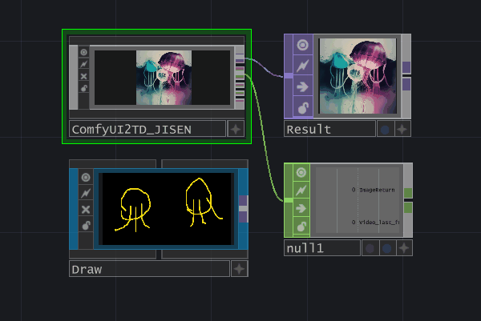
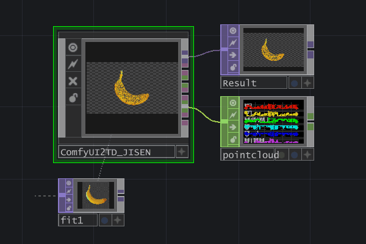
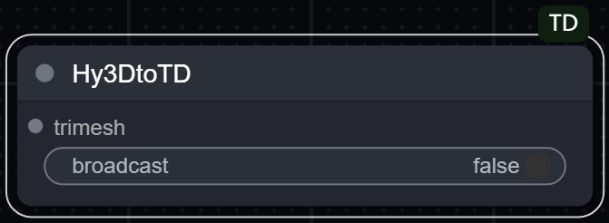
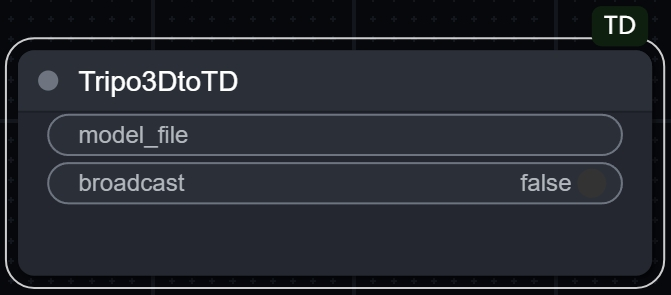
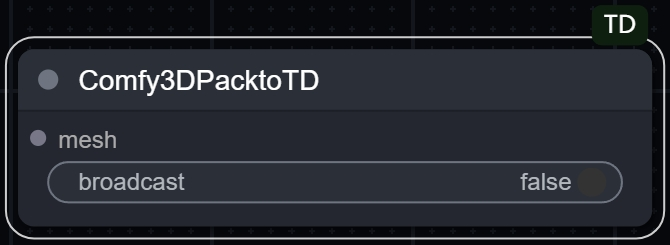
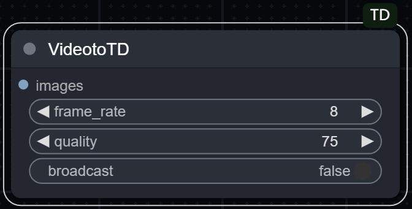
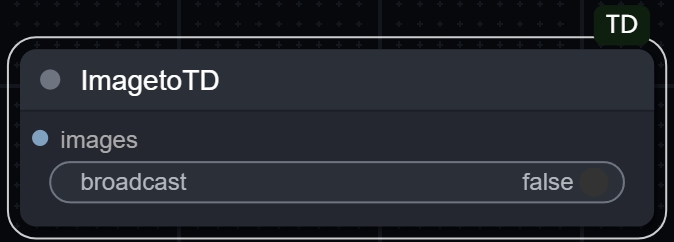
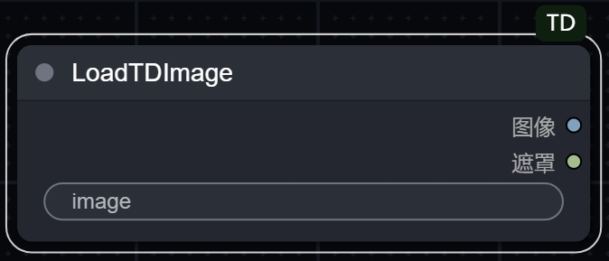

# ComfyUI-TD

This custom node enables seamless data interaction between [TouchDesigner](https://derivative.ca/) (hereinafter referred to as "TD") and [ComfyUI](https://github.com/comfyanonymous/ComfyUI).

Supports real-time transmission of **images**, **videos**, and **3D models (point clouds)** generated by ComfyUI into TD.

| | | |
|:---:|:---:|:---:|
|  |  |  |

# [🇨🇳 中文版 README](README_zh.md)

## User Notice
- **ComfyUI-TD** nodes are ported and optimized based on [ComfyUI-Tooling-Nodes](https://github.com/Acly/comfyui-tooling-nodes/tree/main).
- **ComfyUI-TD** requires the **ComfyUI2TD.tox** component to work.  
- Please ensure that the **ComfyUI2TD.tox** component is updated to version **v_5.1.x** or later. This version features a complete code overhaul, supporting video and 3D model (point cloud) data transmission. The WebSocket interface has also been rewritten to effectively resolve issues where data (images) might not return properly under poor network conditions when using a cloud-based ComfyUI.  
- Starting from version **v_5.1.x**, the pre-configured workflows in **ComfyUI2TD.tox** use ComfyUI-TD nodes instead of [ComfyUI-Tooling-Nodes](https://github.com/Acly/comfyui-tooling-nodes/tree/main).
- Older versions of **ComfyUI2TD.tox** were developed based on the [TDComfyUI](https://github.com/olegchomp/TDComfyUI) project. Thanks to olegchomp!
- If you need to use a cloud-based ComfyUI, you can choose the [Xiangongyun](https://www.xiangongyun.com/register/YALSMH) server. A [compatible image](https://www.xiangongyun.com/image/detail/5f185465-ef11-42e5-ba21-3ee07acb5403) is ready.

---

## Usage Instructions
### Video Tutorials
- Please watch the following videos in order.
- [1. Basic Tutorial for ComfyUI2TD Plugin (Bilibili)]( https://www.bilibili.com/video/BV18t4oeNEgj/?share_source=copy_web&vd_source=3900738a289821efe0ce52f9c9fb663f)
- [2. Tutorial for Using Xiangongyun Cloud (Bilibili)](https://www.bilibili.com/video/BV1RxUyYyEeU/?share_source=copy_web&vd_source=3900738a289821efe0ce52f9c9fb663f)
- [3. New Tutorial for ComfyUI2TD_v 5.1 (In Production...)]()

---

### Installation of ComfyUI-TD Nodes
#### Method 1: (Currently Unavailable)
- Use [ComfyUI-Manager](https://github.com/ltdrdata/ComfyUI-Manager?tab=readme-ov-file) to search for **ComfyUI-TD** and directly install the nodes.

#### Method 2:
- Manual Installation: Download and extract this project, then place it in `X:\ComfyUI_windows_portable\ComfyUI\custom_nodes`.

#### Method 3:
- Install using the git clone command.
```
cd custom_nodes
git clone https://github.com/JiSenHua/ComfyUI-TD.git
```

#### Method 4:
- Use the `InjectFile` feature of the **ComfyUI2TD.tox** component to automatically inject the nodes into `X:\ComfyUI_windows_portable\ComfyUI\custom_nodes`.

---

## ComfyUI-TD Node Documentation

|  |
|:---|
| **Hy3DtoTD** |
| - This node supports converting GLB models generated by **Hunyuan3D_V2** into point cloud data, which can then be sent to **TD** for parsing to generate corresponding CHOP components.<br>- Requires installation of the [ComfyUI-Hunyuan3DWrapper](https://github.com/kijai/ComfyUI-Hunyuan3DWrapper) node.<br>- If you encounter difficulties installing [ComfyUI-Hunyuan3DWrapper](https://github.com/kijai/ComfyUI-Hunyuan3DWrapper), you can use the cloud-based [**Xiangongyun** image](https://www.xiangongyun.com/image/detail/5f185465-ef11-42e5-ba21-3ee07acb5403).<br>- The **ComfyUI2TD.tox** workflow preset **Hunyuan3DV2_PointCloud** provides a basic example for using this node. The corresponding `.js` workflow file is available in the `workflow` folder.<br>- The latest version of [ComfyUI-Hunyuan3DWrapper](https://github.com/kijai/ComfyUI-Hunyuan3DWrapper) has migrated all model workflows to `trimesh`.<br>- It is recommended to install [ComfyUI_essentials](https://github.com/cubiq/ComfyUI_essentials) to avoid errors when running preset workflows.<br>- `broadcast` parameter (disabled by default): When enabled, the generated point cloud data will be broadcast to all clients with an established WebSocket connection. |

|  |
|:---|
| **Tripo3DtoTD** |
| - This node supports converting GLB models generated by **Tripo3D** into point cloud data, which can then be sent to **TD** for parsing to generate corresponding CHOP components.<br>- Requires installation of the [ComfyUI-Tripo](https://github.com/VAST-AI-Research/ComfyUI-Tripo) node.<br>- Tripo is not an open-source model. You need to register an account and apply for an API on the [Tripo official website](https://platform.tripo3d.ai/).<br>- The **ComfyUI2TD.tox** workflow preset **Tripo3D_PointCloud** provides a basic example for using this node. The corresponding `.js` workflow file is available in the `workflow` folder.<br>- `broadcast` parameter (disabled by default): When enabled, the generated point cloud data will be broadcast to all clients with an established WebSocket connection. |

|  |
|:---|
| **Comfy3DPacktoTD** |
| - This node supports converting GLB models generated by **3DPack** into point cloud data, which can then be sent to **TD** for parsing to generate corresponding CHOP components.<br>- Requires installation of the [ComfyUI-3D-Pack](https://github.com/MrForExample/ComfyUI-3D-Pack) node.<br>- If you encounter difficulties installing [ComfyUI-3D-Pack](https://github.com/MrForExample/ComfyUI-3D-Pack), you can use the cloud-based [**Xiangongyun** image](https://www.xiangongyun.com/image/detail/5f185465-ef11-42e5-ba21-3ee07acb5403).<br>- The **ComfyUI2TD.tox** workflow preset **3DPack_xxx_PointCloud** provides a basic example for using this node. The corresponding `.js` workflow file is available in the `workflow` folder.<br>- **Hunyuan3D_V2** in **3DPack** is not compatible with **Hunyuan3DWrapper**. Please ensure you use the corresponding transfer nodes.<br>- `broadcast` parameter (disabled by default): When enabled, the generated point cloud data will be broadcast to all clients with an established WebSocket connection.<br>- **Note**: Currently, the Xiangongyun cloud image has only been tested with **TRELLIS**, **Hunyuan3D_V2**, and **StableFast3D**. Other 3D models are yet to be verified. Please report any issues in the Issues section. |

|  |
|:---|
| **VideotoTD** |
| - This node supports converting videos into data, which can then be sent to **TD** for parsing.<br>- Replace **Video Combine 🎥🅥🅗🅢** in your workflow from [ComfyUI-VideoHelperSuite](https://github.com/Kosinkadink/ComfyUI-VideoHelperSuite) with this node.<br>- The **frame_rate** parameter affects the frame rate of the video synthesis. A value of 8 is recommended.<br>- The **quality** parameter controls the compression quality of the video. A value of 75 is recommended for a balance between file size and image quality.<br>- Data will be parsed via **ComfyUI2TD.tox** and saved as `.MP4` files in the `VideoOutput` folder located in the root directory.<br>- `broadcast` parameter (disabled by default): When enabled, the generated point cloud data will be broadcast to all clients with an established WebSocket connection. |

|  |
|:---|
| **ImagetoTD** |
| - Based on the [ComfyUI-Tooling-Nodes](https://github.com/Acly/comfyui-tooling-nodes/tree/main) **Send Image (WebSocket)** node with additional development.<br>- This node supports sending images generated by ComfyUI to **TD** for parsing to generate corresponding TOP components.<br>- `broadcast` parameter (disabled by default): When enabled, the generated image data will be broadcast to all clients with an established WebSocket connection.<br>- From version **v_5.1.x** onwards, the **ComfyUI2TD.tox** component will use ComfyUI-TD nodes in preset workflows instead of [ComfyUI-Tooling-Nodes](https://github.com/Acly/comfyui-tooling-nodes/tree/main). |

|  |
|:---|
| **LoadTDImage** |
| - Based on the [ComfyUI-Tooling-Nodes](https://github.com/Acly/comfyui-tooling-nodes/tree/main) **Load Image (Base64)** node with additional development.<br>- This node supports using TOP components sent from TD as image input sources for ComfyUI.<br>- From version **v_5.1.x** onwards, the **ComfyUI2TD.tox** component will use ComfyUI-TD nodes in preset workflows instead of [ComfyUI-Tooling-Nodes](https://github.com/Acly/comfyui-tooling-nodes/tree/main). |
