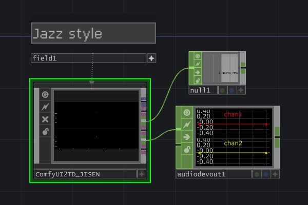
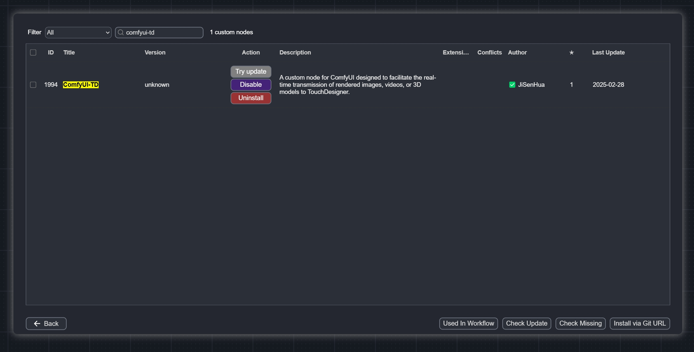
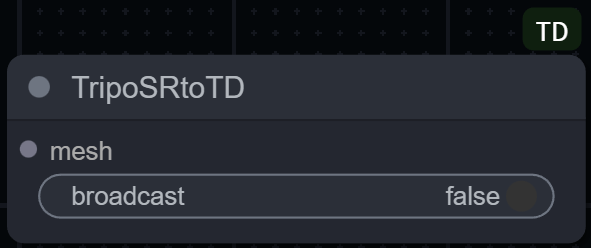
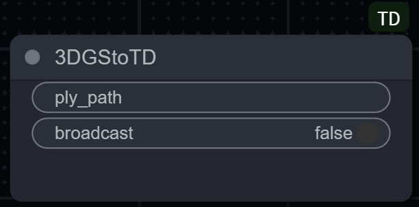
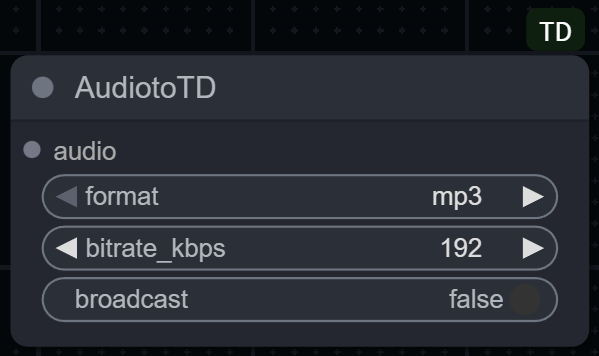
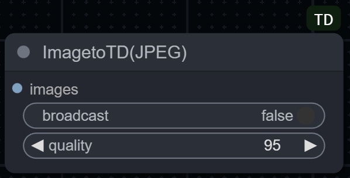

# ComfyUI-TD

This node implements seamless data interaction between [TouchDesigner](https://derivative.ca/) (hereinafter referred to as "TD") and [ComfyUI](https://github.com/comfyanonymous/ComfyUI).

Supports real-time streaming of ComfyUI-generated **images**, **videos**, **point clouds (traditional PLY / Gaussian Splatting PLY)**, and **audio** into TD.

|       |                 |
|:-------------------------:|:-----------------------------------:|
|  |  |
|       |                                     |

# [🇨🇳 中文 README](README_zh.md)

## User Notice

- Some nodes in **ComfyUI-TD** are ported and optimized based on [ComfyUI-Tooling-Nodes](https://github.com/Acly/comfyui-tooling-nodes/tree/main).
- **ComfyUI-TD** must be used in conjunction with the **ComfyUI2TD.tox** component (the plugin has been uploaded to the `tox` folder).
- Please ensure the **ComfyUI2TD.tox** component is updated to **v_5.1.x** or higher.
  - This version features a complete code refactor, supporting video and 3D model (point cloud) data transmission.
  - The WebSocket interface has been rewritten to effectively resolve issues where data (images) might not return properly when using cloud-based ComfyUI under poor network conditions.
- Starting from **v_5.1.x**, the **ComfyUI2TD.tox** component's preset workflows use ComfyUI-TD nodes and no longer rely on [ComfyUI-Tooling-Nodes](https://github.com/Acly/comfyui-tooling-nodes/tree/main).
- The legacy **ComfyUI2TD.tox** component was developed based on the [TDComfyUI](https://github.com/olegchomp/TDComfyUI) project. Thanks to olegchomp!
- If you need to use cloud-based ComfyUI, you can choose [Xiangongyun](https://www.xiangongyun.com/register/YALSMH) servers; the [matching image](https://www.xiangongyun.com/image/detail/5f185465-ef11-42e5-ba21-3ee07acb5403) is ready.

---

## Instructions

### Video Tutorials

Please watch the following videos in order (Videos are in Chinese):

1. [ComfyUI2TD_v 5.1 New Version Tutorial *Must Watch* (Bilibili)](https://www.bilibili.com/video/BV1BqQ8YDEJq/?share_source=copy_web&vd_source=3900738a289821efe0ce52f9c9fb663f)
2. [ComfyUI2TD Basic Tutorial (Bilibili)](https://www.bilibili.com/video/BV18t4oeNEgj/?share_source=copy_web&vd_source=3900738a289821efe0ce52f9c9fb663f)
3. [Cloud Deployment ComfyUI Xiangongyun Tutorial (Bilibili)](https://www.bilibili.com/video/BV1RxUyYyEeU/?share_source=copy_web&vd_source=3900738a289821efe0ce52f9c9fb663f)

### Installation

#### Method 1: Manager Installation

Use [ComfyUI-Manager](https://github.com/ltdrdata/ComfyUI-Manager?tab=readme-ov-file) to search for **ComfyUI-TD** and install it directly.



#### Method 2: Manual Installation

Download and unzip this project into `X:\ComfyUI_windows_portable\ComfyUI\custom_nodes`.

#### Method 3: Git Clone

Install using the git command:

```bash
cd custom_nodes
git clone https://github.com/JiSenHua/ComfyUI-TD.git
```

#### Method 4: Injection Installation

In conjunction with the **ComfyUI2TD.tox** component, use the `InjectFile` function to automatically inject nodes into `X:\ComfyUI_windows_portable\ComfyUI\custom_nodes`.

---

## Node Descriptions

|                                                                                                                                                                                                                                                                                                                                                                                                                                                                                                                                                                                                                                                                                                                                                                                                                                                                                                                                                                                                                                                            |
|:----------------------------------------------------------------------------------------------------------------------------------------------------------------------------------------------------------------------------------------------------------------------------------------------------------------------------------------------------------------------------------------------------------------------------------------------------------------------------------------------------------------------------------------------------------------------------------------------------------------------------------------------------------------------------------------------------------------------------------------------------------------------------------------------------------------------------------------------------------------------------------------------------------------------------------------------------------------------------------------------------------------------------------------------------------------------------------------------------- |
| **Hy3DtoTD**                                                                                                                                                                                                                                                                                                                                                                                                                                                                                                                                                                                                                                                                                                                                                                                                                                                                                                                                                                                                                                                                                          |
| - This node supports converting GLB models generated by **Hunyuan3D_V2** into point cloud data and returning it to **TD** for parsing, generating the corresponding CHOP component.<br>- Requires [ComfyUI-Hunyuan3DWrapper](https://github.com/kijai/ComfyUI-Hunyuan3DWrapper) node.<br>- If you encounter difficulties installing, consider using the cloud [**Xiangongyun** image](https://www.xiangongyun.com/image/detail/5f185465-ef11-42e5-ba21-3ee07acb5403).<br>- The **ComfyUI2TD.tox** preset workflow **Hunyuan3DV2_PointCloud** provides a basic usage example for this node; the corresponding `.js` workflow file is in the `workflow` folder.<br>- The latest [ComfyUI-Hunyuan3DWrapper](https://github.com/kijai/ComfyUI-Hunyuan3DWrapper) has changed all model workflows to `trimesh`.<br>- It is recommended to install [ComfyUI_essentials](https://github.com/cubiq/ComfyUI_essentials) to avoid errors when running preset workflows.<br>- `broadcast` parameter (default off): When enabled, generated point cloud data will be broadcast to all connected WebSocket clients. |

|                                                                                                                                                                                                                                                                                                                                                                                                                                                                                                                                                                                                                           |
|:----------------------------------------------------------------------------------------------------------------------------------------------------------------------------------------------------------------------------------------------------------------------------------------------------------------------------------------------------------------------------------------------------------------------------------------------------------------------------------------------------------------------------------------------------------------------------------------------------------------------------------------------------------------------- |
| **Tripo3DtoTD**                                                                                                                                                                                                                                                                                                                                                                                                                                                                                                                                                                                                                                                         |
| - This node supports converting GLB models generated by **Tripo3D** into point cloud data and returning it to **TD** for parsing, generating the corresponding CHOP component.<br>- Requires [ComfyUI-Tripo](https://github.com/VAST-AI-Research/ComfyUI-Tripo) node.<br>- **API Update**: Now supports calling Tripo services directly via the official ComfyUI interface. You **NO LONGER** need to register on the Tripo website or apply for an API Key separately. The legacy API configuration method is **deprecated**.<br>- `broadcast` parameter (default off): When enabled, generated point cloud data will be broadcast to all connected WebSocket clients. |

|                                                                                                                                                                                                                                                                                                                                                                             |
|:------------------------------------------------------------------------------------------------------------------------------------------------------------------------------------------------------------------------------------------------------------------------------------------------------------------------------------------------------------------------------------------------------------------------- |
| **TripoSRtoTD**                                                                                                                                                                                                                                                                                                                                                                                                           |
| - This node supports converting GLB models generated by **TripoSR** into point cloud data and returning it to **TD** for parsing, generating the corresponding CHOP component.<br>- Requires [ComfyUI-Flowty-TripoSR](https://github.com/flowtyone/ComfyUI-Flowty-TripoSR) node.<br>- `broadcast` parameter (default off): When enabled, generated point cloud data will be broadcast to all connected WebSocket clients. |

|                                                                                                                                                                                                                                                                                                                                                                                                                                                                                                                                                                                                                                                                                                                                                                                                                                                                                                                                                                                                                                                                                                                               |
|:------------------------------------------------------------------------------------------------------------------------------------------------------------------------------------------------------------------------------------------------------------------------------------------------------------------------------------------------------------------------------------------------------------------------------------------------------------------------------------------------------------------------------------------------------------------------------------------------------------------------------------------------------------------------------------------------------------------------------------------------------------------------------------------------------------------------------------------------------------------------------------------------------------------------------------------------------------------------------------------------------------------------------------------------------------------------------------------------------------------------------------------------------------------------------- |
| **Comfy3DPacktoTD**                                                                                                                                                                                                                                                                                                                                                                                                                                                                                                                                                                                                                                                                                                                                                                                                                                                                                                                                                                                                                                                                                                                                                             |
| - This node supports converting GLB models generated by **3DPack** into point cloud data and returning it to **TD** for parsing, generating the corresponding CHOP component.<br>- Requires [ComfyUI-3D-Pack](https://github.com/MrForExample/ComfyUI-3D-Pack) node.<br>- If you encounter difficulties installing, consider using the cloud [**Xiangongyun** image](https://www.xiangongyun.com/image/detail/5f185465-ef11-42e5-ba21-3ee07acb5403).<br>- The **ComfyUI2TD.tox** preset workflow **3DPack_xxx_PointCloud** provides a basic usage example for this node; the corresponding `.js` workflow file is in the `workflow` folder.<br>- **Hunyuan3D_V2** in **3DPack** and **Hunyuan3DWrapper** are not interchangeable; please ensure you use the corresponding transmission node.<br>- `broadcast` parameter (default off): When enabled, generated point cloud data will be broadcast to all connected WebSocket clients.<br>- **Note**: Currently, the Xiangongyun cloud image has only been tested with **TRELLIS**, **Hunyuan3D_V2**, **TripoSR**, and **StableFast3D**. Other 3D models have not been verified. Please report any issues in the Issues section. |

|                                                                                                                                                                                                                                                                                                                                                                                                                                                                                                                                                                                                                                                                                                                                                                                                                                                                                                                                                                                                                                                                                                                                                                    |
|:----------------------------------------------------------------------------------------------------------------------------------------------------------------------------------------------------------------------------------------------------------------------------------------------------------------------------------------------------------------------------------------------------------------------------------------------------------------------------------------------------------------------------------------------------------------------------------------------------------------------------------------------------------------------------------------------------------------------------------------------------------------------------------------------------------------------------------------------------------------------------------------------------------------------------------------------------------------------------------------------------------------------------------------------------------------------------------------------------------------------------------------------------------------------------------------------------------------------------- |
| **3DGStoTD**                                                                                                                                                                                                                                                                                                                                                                                                                                                                                                                                                                                                                                                                                                                                                                                                                                                                                                                                                                                                                                                                                                                                                                                                                  |
| - This node supports returning PLY model data generated by **3DGS** (**Gaussian Splatting**) to **TD** for parsing, thereby generating the corresponding CHOP components.<br/>- Please ensure that the **ComfyUI2TD.tox** component has been updated to **v_5.3.x** or later.<br/>- To use this node, you must install the [ComfyUI-Sharp](https://github.com/PozzettiAndrea/ComfyUI-Sharp) node.<br/>- If you encounter difficulties during installation, you can choose to use the cloud-based [**Xiangongyun** image](https://www.xiangongyun.com/image/detail/b4be23a3-0ce2-41ce-b06e-e9211ca1b31d?r=PYF5ZQ).<br/>- The **3DGS Gaussian Splatting** preset workflow in **ComfyUI2TD.tox** provides a basic usage example for this node. The corresponding `.js` workflow file has been uploaded to the `workflow` folder.<br/>- `broadcast` parameter (default off): When enabled, generated video data will be broadcast to all connected WebSocket clients.<br/>- The preview component for **Gaussian Splatting** in **ComfyUI2TD.tox** was created using **Tim Gerritsen**’s work; special thanks. The plugin can be downloaded via [this link](https://derivative.ca/community-post/asset/gaussian-splatting/69107). |

|                                                                                                                                                                                                                                                                                                                                                                                                                                                                                                                                                                                                                                                                                                                                       |
|:--------------------------------------------------------------------------------------------------------------------------------------------------------------------------------------------------------------------------------------------------------------------------------------------------------------------------------------------------------------------------------------------------------------------------------------------------------------------------------------------------------------------------------------------------------------------------------------------------------------------------------------------------------------------------------------------------------------------------------------------------------------------------------- |
| **VideotoTD**                                                                                                                                                                                                                                                                                                                                                                                                                                                                                                                                                                                                                                                                                                                                                                     |
| - This node supports converting video to data and returning it to **TD** for parsing.<br>- Replace the **Video Combine 🎥🅥🅗🅢** node from [ComfyUI-VideoHelperSuite](https://github.com/Kosinkadink/ComfyUI-VideoHelperSuite) in your workflow with this node.<br>- **frame_rate**: Affects the synthesis frame rate of the video; 8 is recommended.<br>- **quality**: Controls video compression quality; 75 is recommended for a good balance between data size and image quality.<br>- Data will be parsed by **ComfyUI2TD.tox**, and an `.MP4` file will be generated and saved in the `VideoOutput` folder in the local root directory.<br>- `broadcast` parameter (default off): When enabled, generated video data will be broadcast to all connected WebSocket clients. |

|                                                                                                                                                                                                                                                                                                                                                                                                                                                                                                                                                                  |
|:------------------------------------------------------------------------------------------------------------------------------------------------------------------------------------------------------------------------------------------------------------------------------------------------------------------------------------------------------------------------------------------------------------------------------------------------------------------------------------------------------------------------------------------------------------------------------------------------------------ |
| **ImagetoTD**                                                                                                                                                                                                                                                                                                                                                                                                                                                                                                                                                                                                |
| - Secondary development based on [ComfyUI-Tooling-Nodes](https://github.com/Acly/comfyui-tooling-nodes/tree/main) **Send Image (WebSocket)** node.<br>- This node supports returning images generated by ComfyUI to **TD** for parsing, generating the corresponding TOP component.<br>- `broadcast` parameter (default off): When enabled, generated image data will be broadcast to all connected WebSocket clients.<br>- Starting from **v_5.1.x**, **ComfyUI2TD.tox** preset workflows use ComfyUI-TD nodes instead of [ComfyUI-Tooling-Nodes](https://github.com/Acly/comfyui-tooling-nodes/tree/main). |

|                                                                                                                                                                                                                                                                                                                                                                                          |
|:------------------------------------------------------------------------------------------------------------------------------------------------------------------------------------------------------------------------------------------------------------------------------------------------------------------------------------------------------------------------------------------------------------------------------------ |
| **AudiotoTD**                                                                                                                                                                                                                                                                                                                                                                                                                        |
| - This node supports returning audio generated by ComfyUI to **TD** for parsing, generating the corresponding CHOP component.<br>- **format**: Supports selecting output format as **wav** or **mp3**.<br>- **bitrate_kbps**: Sets the audio bitrate to adjust output audio quality and size.<br>- `broadcast` parameter (default off): When enabled, generated **audio data** will be broadcast to all connected WebSocket clients. |

|                                                                                                                                                                                                                                                                                                                                                                                                                                                                                                                                                                                                                                                                                                                                                             |
|:------------------------------------------------------------------------------------------------------------------------------------------------------------------------------------------------------------------------------------------------------------------------------------------------------------------------------------------------------------------------------------------------------------------------------------------------------------------------------------------------------------------------------------------------------------------------------------------------------------------------------------------------------------------------------------------------------------------------------------------------------------------------------------------------------------- |
| **ImagetoTD(JPEG)**                                                                                                                                                                                                                                                                                                                                                                                                                                                                                                                                                                                                                                                                                                                                                                                           |
| - **JPEG Transmission Mode**: This node encodes the image generated by ComfyUI into **JPEG compressed format** and returns it to **TD** via WebSocket for parsing into a TOP component.<br>- **Performance & Scenario**: Compared to the standard `ImageToTD` method, JPEG format significantly reduces transmitted data size. This speeds up transmission and parsing, making it especially suitable for **Cloud ComfyUI** users to reduce bandwidth requirements.<br>- **Quality**: Due to compression, image quality will be lower than `ImageToTD`. Please balance according to actual needs.<br>- **quality**: Controls image compression quality; 85 is recommended.<br>- `broadcast` parameter (default off): When enabled, generated image data will be broadcast to all connected WebSocket clients. |

|                                                                                                                                                                                                                                                                                                                                                                                       |
|:----------------------------------------------------------------------------------------------------------------------------------------------------------------------------------------------------------------------------------------------------------------------------------------------------------------------------------------------------------------------------------------------------------------------------------- |
| **LoadTDImage**                                                                                                                                                                                                                                                                                                                                                                                                                     |
| - Secondary development based on [ComfyUI-Tooling-Nodes](https://github.com/Acly/comfyui-tooling-nodes/tree/main) **Load Image (Base64)** node.<br>- This node supports using TOP components sent from TD as image input sources for ComfyUI.<br>- Starting from **v_5.1.x**, **ComfyUI2TD.tox** preset workflows use ComfyUI-TD nodes instead of [ComfyUI-Tooling-Nodes](https://github.com/Acly/comfyui-tooling-nodes/tree/main). |
