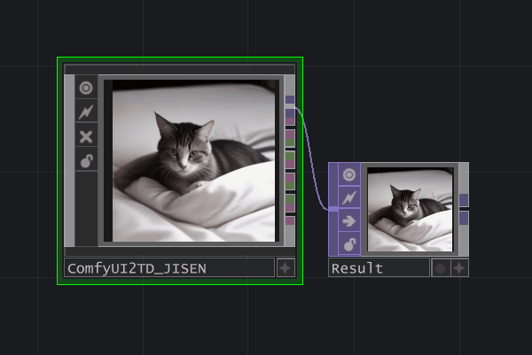
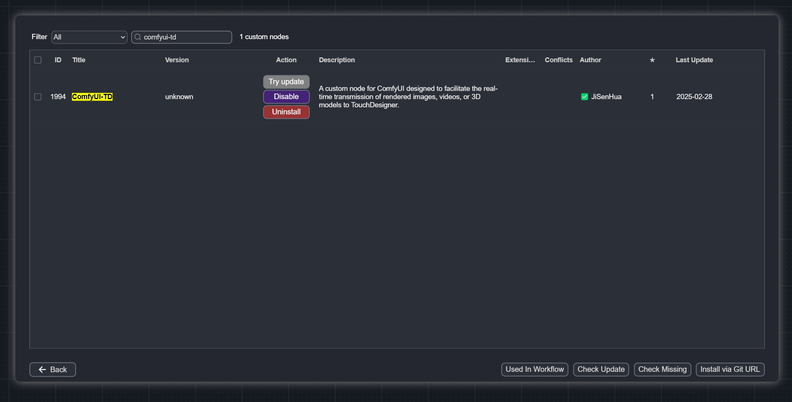
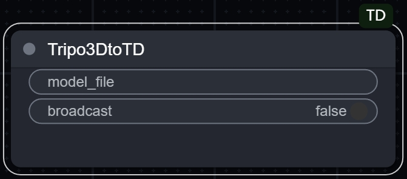
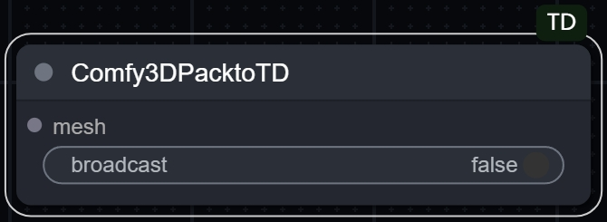
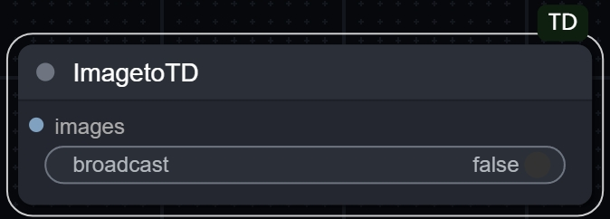
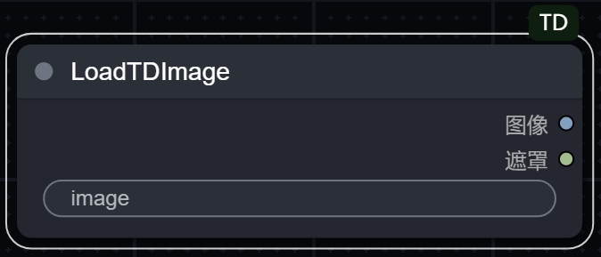

# ComfyUI-TD

本节点实现了 [TouchDesigner](https://derivative.ca/)（以下简称 "TD"）与 [ComfyUI](https://github.com/comfyanonymous/ComfyUI) 之间的无缝数据交互。

支持将ComfyUI生成的**图像**、**视频**、**3D模型(点云)** 、**音频**数据实时传输进TD。

|                     |                         |
|:---------------------------------------:|:-------------------------------------------:|
|  |  |

# [🇺🇸 English README](README.md)

## 用户须知

- **ComfyUI-TD** 的部分节点基于[ComfyUI-Tooling-Nodes](https://github.com/Acly/comfyui-tooling-nodes/tree/main)进行了移植和优化。
- **ComfyUI-TD** 需与 **ComfyUI2TD.tox** 组件配合使用（插件已上传至`tox`文件夹）。  
- 请确保**ComfyUI2TD.tox** 组件版本更新至 **v_5.1.x** 或更高版本。此版本对组件代码进行了全面重构，支持了视频与3D模型(点云)的数据传输。另重写了WebSocket接口，有效解决了在网络条件较差时，使用云端ComfyUI可能出现的数据（图像）无法正常返回的问题。   
- **ComfyUI2TD.tox** 组件至 **v_5.1.x** 版本起，预置的工作流将使用ComfyUI-TD节点，不再使用于[ComfyUI-Tooling-Nodes](https://github.com/Acly/comfyui-tooling-nodes/tree/main)。
- 旧版 **ComfyUI2TD.tox** 组件基于[TDComfyUI](https://github.com/olegchomp/TDComfyUI)项目开发，感谢olegchomp！
- 若需使用云端ComfyUI，可选择[仙宫云](https://www.xiangongyun.com/register/YALSMH)服务器，[配套镜像](https://www.xiangongyun.com/image/detail/5f185465-ef11-42e5-ba21-3ee07acb5403)已准备完毕。

---

## 使用说明

### 视频教程

- 请按照顺序观看以下视频。
- [1. ComfyUI2TD_v 5.1 新版使用教程 * 必看*(哔哩哔哩)]( https://www.bilibili.com/video/BV1BqQ8YDEJq/?share_source=copy_web&vd_source=3900738a289821efe0ce52f9c9fb663f)
- [2. ComfyUI2TD基础使用教程(哔哩哔哩)]( https://www.bilibili.com/video/BV18t4oeNEgj/?share_source=copy_web&vd_source=3900738a289821efe0ce52f9c9fb663f)
- [3. 云端部署ComfyUI 仙宫云使用教程(哔哩哔哩)](https://www.bilibili.com/video/BV1RxUyYyEeU/?share_source=copy_web&vd_source=3900738a289821efe0ce52f9c9fb663f)

---

### ComfyUI-TD节点安装

#### 方法一：

- 使用[ComfyUI-Manager](https://github.com/ltdrdata/ComfyUI-Manager?tab=readme-ov-file)搜索**ComfyUI-TD**，并直接进行节点安装。  

- 
  
  #### 方法二：

- 手动安装：将本项目下载后解压放置于`X:\ComfyUI_windows_portable\ComfyUI\custom_nodes`。

#### 方法三：

- 使用git clone命令进行安装。
  
  ```
  cd custom_nodes
  git clone https://github.com/JiSenHua/ComfyUI-TD.git
  ```
  
  #### 方法四：

- 配合**ComfyUI2TD.tox**组件，使用`InjectFile 注入插件`功能，将节点自动注入至`X:\ComfyUI_windows_portable\ComfyUI\custom_nodes`。

---

## ComfyUI-TD节点说明

|                                                                                                                                                                                                                                                                                                                                                                                                                                                                                                                                                                                                                                                                                                                        |
|:---------------------------------------------------------------------------------------------------------------------------------------------------------------------------------------------------------------------------------------------------------------------------------------------------------------------------------------------------------------------------------------------------------------------------------------------------------------------------------------------------------------------------------------------------------------------------------------------------------------------------------------------------------------------------------------------------------------------------------------------------------- |
| **Hy3DtoTD**                                                                                                                                                                                                                                                                                                                                                                                                                                                                                                                                                                                                                                                                                                                                               |
| - 本节点支持将**Hunyuan3D_V2 混元V2**生成的GLB模型转换为点云数据，并返回至 **TD** 进行解析，从而生成对应的CHOP组件。<br>- 使用本节点需安装[ComfyUI-Hunyuan3DWrapper](https://github.com/kijai/ComfyUI-Hunyuan3DWrapper)节点。<br>- 若安装[ComfyUI-Hunyuan3DWrapper](https://github.com/kijai/ComfyUI-Hunyuan3DWrapper)遇到困难，可选择使用云端[**仙宫云**镜像](https://www.xiangongyun.com/image/detail/5f185465-ef11-42e5-ba21-3ee07acb5403)。<br>- **ComfyUI2TD.tox** 预置的工作流 **Hunyuan3DV2_PointCloud** 提供了此节点的基础用法示例，对应的`.js`工作流文件已上传至`workflow`文件夹。<br>- 最新的[ComfyUI-Hunyuan3DWrapper](https://github.com/kijai/ComfyUI-Hunyuan3DWrapper)已将所有模型工作流改为`trimesh`。<br>- 建议配套安装[ComfyUI_essentials](https://github.com/cubiq/ComfyUI_essentials)，避免运行预置工作流时报错。<br>- `broadcast`广播参数（默认关闭）：启用该参数后，生成的点云数据将广播至所有已建立 WebSocket 连接的客户端。 |

|                                                                                                                                                                                                                                                                                                |
|:---------------------------------------------------------------------------------------------------------------------------------------------------------------------------------------------------------------------------------------------------------------------------------------------------------------------------------------- |
| **Tripo3DtoTD**                                                                                                                                                                                                                                                                                                                          |
| - 本节点支持将**Tripo3D**生成的GLB模型转换为点云数据，并返回至 **TD** 进行解析，从而生成对应的CHOP组件。<br>- 使用本节点需安装[ComfyUI-Tripo](https://github.com/VAST-AI-Research/ComfyUI-Tripo)节点。<br>- **API 调用更新**：现已支持直接通过 ComfyUI 官方接口调用 Tripo 服务，**无需**再前往 Tripo 官网注册账户或单独申请 API Key，旧版的独立 API 配置方式已**弃用**。<br>- `broadcast`广播参数（默认关闭）：启用该参数后，生成的点云数据将广播至所有已建立 WebSocket 连接的客户端。 |

|                                                                                                                                                                                |
|:------------------------------------------------------------------------------------------------------------------------------------------------------------------------------------------------------------------------------------- |
| **TripoSRtoTD**                                                                                                                                                                                                                       |
| - 本节点支持将**TripoSR**生成的GLB模型转换为点云数据，并返回至 **TD** 进行解析，从而生成对应的CHOP组件。<br>- 使用本节点需安装[ComfyUI-Flowty-TripoSR](https://github.com/flowtyone/ComfyUI-Flowty-TripoSR)节点。<br>- `broadcast`广播参数（默认关闭）：启用该参数后，生成的点云数据将广播至所有已建立 WebSocket 连接的客户端。 |

|                                                                                                                                                                                                                                                                                                                                                                                                                                                                                                                                                                                                                                                             |
|:------------------------------------------------------------------------------------------------------------------------------------------------------------------------------------------------------------------------------------------------------------------------------------------------------------------------------------------------------------------------------------------------------------------------------------------------------------------------------------------------------------------------------------------------------------------------------------------------------------------------------------------------------------------------------------------------------------- |
| **Comfy3DPacktoTD**                                                                                                                                                                                                                                                                                                                                                                                                                                                                                                                                                                                                                                                                                           |
| - 本节点支持将**3DPack**生成的GLB模型转换为点云数据，并返回至 **TD** 进行解析，从而生成对应的CHOP组件。<br>- 使用本节点需安装[ComfyUI-3D-Pack](https://github.com/MrForExample/ComfyUI-3D-Pack)节点。<br>- 若安装[ComfyUI-3D-Pack](https://github.com/MrForExample/ComfyUI-3D-Pack)遇到困难，可选择使用云端[**仙宫云**镜像](https://www.xiangongyun.com/image/detail/5f185465-ef11-42e5-ba21-3ee07acb5403)。<br>- **ComfyUI2TD.tox** 预置的工作流 **3DPack_xxx_PointCloud** 提供了此节点的基础用法示例，对应的`.js`工作流文件已上传至`workflow`文件夹。<br>- **3DPack**中的**Hunyuan3D_V2**与**Hunyuan3DWrapper**并不互通，请确保使用各自对应的传输节点<br>- `broadcast`广播参数（默认关闭）：启用该参数后，生成的点云数据将广播至所有已建立 WebSocket 连接的客户端。<br>- **注意**：目前仙宫云端镜像仅对**TRELLIS**、**Hunyuan3D_V2**、**TripoSR**和**StableFast3D**进行了测试。其他3D模型尚未验证，如遇问题请在Issues中反馈。 |

|                                                                                                                                                                                                                                                                                                                                                                        |
|:------------------------------------------------------------------------------------------------------------------------------------------------------------------------------------------------------------------------------------------------------------------------------------------------------------------------------------------------------------------------------------------------------------ |
| **VideotoTD**                                                                                                                                                                                                                                                                                                                                                                                                |
| - 本节点支持将视频转为数据，并返回至 **TD** 进行解析。<br>- 将你工作流中[ComfyUI-VideoHelperSuite](https://github.com/Kosinkadink/ComfyUI-VideoHelperSuite)**Video Combine 🎥🅥🅗🅢**替换成此节点。<br>- **frame_rate** 参数影响视频的合成帧率，建议选择8。<br>- **quality** 参数控制视频的压缩质量，建议选择75，以获得较好的数据大小与图像质量的平衡。<br>- 数据将通过**ComfyUI2TD.tox**解析，并生成`.MP4`格式文件保存在本地根目录中`VideoOutput`文件夹内。<br>- `broadcast`广播参数（默认关闭）：启用该参数后，生成的点云数据将广播至所有已建立 WebSocket 连接的客户端。 |

|                                                                                                                                                                                                                                                                                                                                                                     |
|:--------------------------------------------------------------------------------------------------------------------------------------------------------------------------------------------------------------------------------------------------------------------------------------------------------------------------------------------------------------------------------------------------------- |
| **ImagetoTD**                                                                                                                                                                                                                                                                                                                                                                                             |
| - 基于[ComfyUI-Tooling-Nodes](https://github.com/Acly/comfyui-tooling-nodes/tree/main) **Send Image (WebSocket)** 节点二次开发。<br>- 本节点支持将ComfyUI生成的图片返回至 **TD** 进行解析，从而生成对应的TOP组件。<br>- `broadcast`广播参数（默认关闭）：启用该参数后，生成的图片数据将广播至所有已建立 WebSocket 连接的客户端。<br>- **ComfyUI2TD.tox**组件至 **v_5.1.x** 版本起，预置的工作流将使用ComfyUI-TD节点，不再使用于[ComfyUI-Tooling-Nodes](https://github.com/Acly/comfyui-tooling-nodes/tree/main)。 |

|                                                                                                                                                                              |
|:------------------------------------------------------------------------------------------------------------------------------------------------------------------------------------------------------------------------------- |
| **AudiotoTD**                                                                                                                                                                                                                   |
| - 本节点支持将ComfyUI生成的音频返回至 **TD** 进行解析，从而生成对应的CHOP组件。<br>-**format** 参数：支持选择输出格式为 **wav** 或 **mp3**。<br>- **bitrate_kbps** 参数：设置音频比特率，用于调节输出音频的质量与大小。<br>- `broadcast` 广播参数（默认关闭）：启用该参数后，生成的**音频数据**将广播至所有已建立 WebSocket 连接的客户端。 \| |

| .png)                                                                                                                                                                                                                                                                                                                                                     |
|:------------------------------------------------------------------------------------------------------------------------------------------------------------------------------------------------------------------------------------------------------------------------------------------------------------------------------------------------------------------------------------------------------------------- |
| **ImagetoTD(JPEG)**                                                                                                                                                                                                                                                                                                                                                                                                 |
| - **JPEG 传输模式**：本节点会将 ComfyUI 生成的图像编码为 **JPEG 压缩格式** 后，通过 WebSocket 返回至 **TD** 进行解析生成 TOP 元件。
<br/>- **性能与场景**：相比于标准的 `ImageToTD` 方式，JPEG 格式显著减少了传输的数据量。这不仅加快了传输与解析速度，更特别适合 **云端部署 ComfyUI** 的用户，能有效降低网络带宽需求。
<br/>- **画质说明**：由于采用了压缩传输，图像质量相比 `ImageToTD` 会有所降低，请根据实际需求权衡使用。
<br/>- `broadcast` 广播参数（默认关闭）：启用该参数后，生成的图片数据将广播至所有已建立 WebSocket 连接的客户端。
<br/>- **quality** 参数控制图像的压缩质量，建议选择85，以获得较好的数据大小与图像质量的平衡。<br> |

|                                                                                                                                                                                                                                                                            |
|:-------------------------------------------------------------------------------------------------------------------------------------------------------------------------------------------------------------------------------------------------------------------------------------------------------------------- |
| **LoadTDImage**                                                                                                                                                                                                                                                                                                      |
| - 基于[ComfyUI-Tooling-Nodes](https://github.com/Acly/comfyui-tooling-nodes/tree/main) **Load Image (Base64)** 节点二次开发。<br>- 本节点支持由TD发送的TOP元件作为图像输入源发送给ComfyUI。<br>- **ComfyUI2TD.tox**组件至 **v_5.1.x** 版本起，预置的工作流将使用ComfyUI-TD节点，不再使用于[ComfyUI-Tooling-Nodes](https://github.com/Acly/comfyui-tooling-nodes/tree/main)。 |
